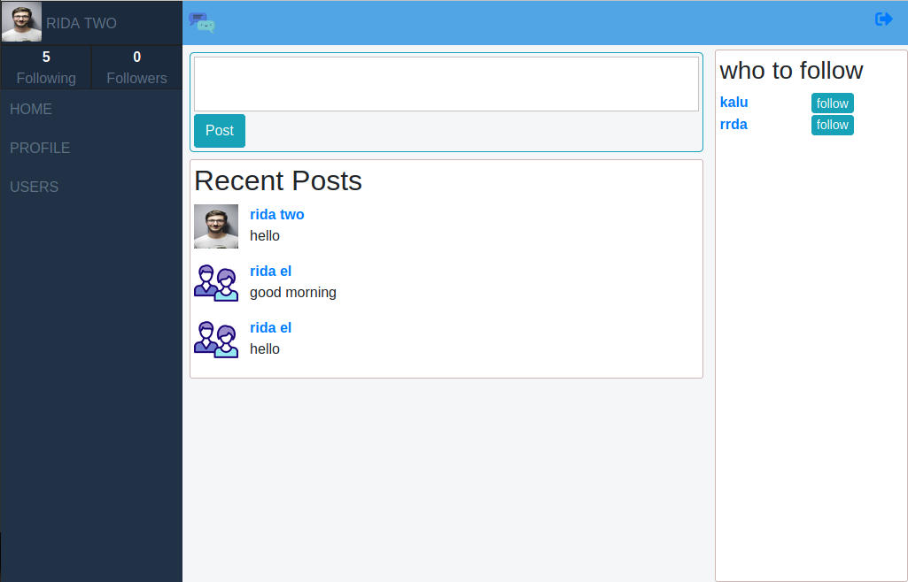
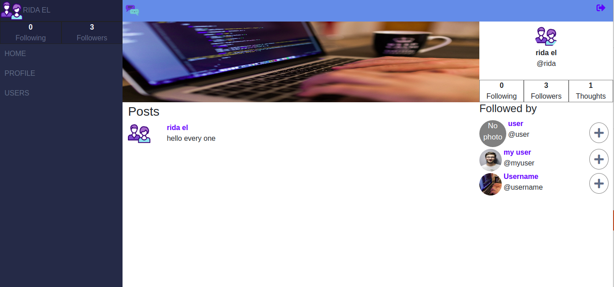

# Car Discussion

> This repo includes a social media app that will allow the user to signin and signup,follow friends , share his thought with them.
> and  It allow user to search for other users by there full name or username.  
## Project features

- Create an account
- Add a profile and cover image
- Follow users
- Unfollow users
- Publish posts
- Read others posts
- Search for users
 

## Built With

- Ruby v2.7.0
- Ruby on Rails v5.2.4


## Screenshot







## Video
- [presentation of the project](https://www.loom.com/share/78f482a44ed744c599e7c3a891bea0e7)
## Getting Started

To get a local copy up and running follow these simple example steps.

### Prerequisites

Ruby: 2.6.3

Rails: 5.2.3

Postgres: >=9.5

[Chromdriver](https://github.com/SeleniumHQ/selenium/wiki/ChromeDriver)

### Clone the Project

```
$ git clone https://github.com/rida-elbahtouri/ThoughtSpace.git

$ cd ThoughtSpace
```

### Setup

Instal gems with:

```
bundle install
```

Setup database with:

```
   rails db:create
   rails db:migrate
```


### Usage

Start server with:

```
    rails server
```

Open `http://localhost:3000/` in your browser.


# Testing

To run the testing, you need to have ChromeDriver installed in your environment.
Run one of this commands respected to your system:

```
Mac users with Homebrew installed: brew tap homebrew/cask && brew cask install chromedriver
Debian based Linux distros: sudo apt-get install chromium-chromedriver
Windows users with Chocolatey installed: choco install chromedriver

```


Now you can run the testing using this command:

```
rspec

```
## PS 
if you still have a problem with webdriver try add gem 'webdrivers' to The Gemfile then run bundle install again


## Developer


👤 **Rida Elbahtouri**
- [Github](https://github.com/rida-elbahtouri)
- [Twitter](https://twitter.com/RElbahtouri)
- [Linkedin](https://www.linkedin.com/in/rida-elbahtouri/)

## 🤝 Contributing


Contributions, issues and feature requests are welcome!

Feel free to check the <a href="https://github.comrida-elbahtouri/ThoughtSpace//issues" target="_blank">issues page</a>.

## Show your support

Give a ⭐️ if you like this project!

## Acknowledgments
 
- <a href="https://www.theodinproject.com/" target="_blank">The Odin Project</a>
- <a href="https://guides.rubyonrails.org/" target="_blank">Rails Guides</a>